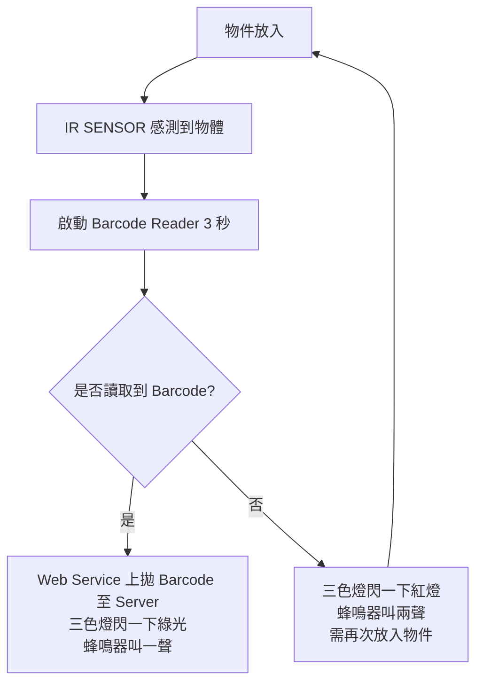

# Public





```mermaid

flowchart LR
    RPI[樹梅派 (Raspberry Pi)\n主控端\n負責讀取 Arduino 資料、上拋 Web Service] 
    MEGA[Arduino Mega\n讀取 20 組 IR Sensor\n讀取 Barcode Reader 訊號]

    subgraph Sensors[感測器與讀取裝置]
        IR[20 個 IR Sensor]
        BR[Barcode Reader]
    end

    IR --> MEGA
    BR --> MEGA
    MEGA --> RPI

```


```txt
/*
  IR Sensor Health Check System
  自動檢測紅外線距離感測器健康狀態
  作者: ChatGPT x JIA_WEI Du
  功能:
  1. 檢查輸出電壓範圍
  2. 測試輸出是否隨距離變化
  3. 計算雜訊標準差
  4. 偵測長時間無變化
  5. 綜合健康評分輸出
*/

const int sensorPin = A0;      // 感測器接腳
const int sampleCount = 50;    // 每次取樣數
const float voltageMin = 0.3;  // 允許最小電壓
const float voltageMax = 3.0;  // 允許最大電壓
const unsigned long responseTimeout = 5000; // 無變化最長允許時間

float lastVoltage = 0;
unsigned long lastChangeTime = 0;

void setup() {
  Serial.begin(9600);
  delay(1000);
  Serial.println("=== IR Sensor Health Check System ===");
}

void loop() {
  // Step 1️⃣: 連續取樣
  float readings[sampleCount];
  for (int i = 0; i < sampleCount; i++) {
    readings[i] = analogRead(sensorPin) * (5.0 / 1023.0);
    delay(20);
  }

  // Step 2️⃣: 計算平均與標準差
  float mean = 0, stddev = 0;
  for (int i = 0; i < sampleCount; i++) mean += readings[i];
  mean /= sampleCount;
  for (int i = 0; i < sampleCount; i++) stddev += pow(readings[i] - mean, 2);
  stddev = sqrt(stddev / sampleCount);

  // Step 3️⃣: 電壓範圍檢查
  bool voltage_ok = (mean >= voltageMin && mean <= voltageMax);

  // Step 4️⃣: 反應變化檢查
  bool response_ok = abs(mean - lastVoltage) > 0.05; // 50mV 變化視為反應
  if (response_ok) {
    lastChangeTime = millis();
  }

  // Step 5️⃣: 超時檢測
  bool timeout_fault = (millis() - lastChangeTime > responseTimeout);

  // Step 6️⃣: 健康評分 (簡單線性估算)
  int health = 100;
  if (!voltage_ok) health -= 40;
  if (stddev > 0.15) health -= 25;
  if (!response_ok) health -= 15;
  if (timeout_fault) health -= 20;
  if (health < 0) health = 0;

  // Step 7️⃣: 輸出報告
  Serial.println("------------------------------------");
  Serial.print("平均電壓: "); Serial.print(mean, 2); Serial.println(" V");
  Serial.print("標準差: "); Serial.print(stddev, 3);
  Serial.println(" (雜訊程度)");
  Serial.print("健康評分: "); Serial.print(health); Serial.println(" / 100");

  if (!voltage_ok) Serial.println("⚠️ 電壓異常：可能供電問題或模組故障");
  if (stddev > 0.15) Serial.println("⚠️ 雜訊過高：可能鏡頭髒污或光線干擾");
  if (timeout_fault) Serial.println("⚠️ 無回應：感測器輸出卡死");
  if (health >= 90) Serial.println("✅ 狀態：健康正常");
  else if (health >= 70) Serial.println("⚠️ 狀態：需觀察");
  else Serial.println("❌ 狀態：建議更換感測器");

  Serial.println("------------------------------------\n");

  lastVoltage = mean;
  delay(2000);
}
```


